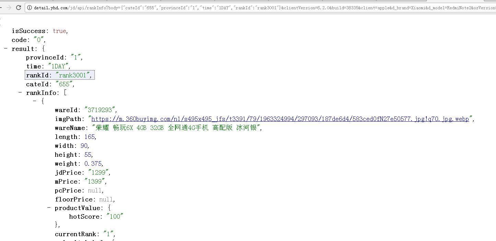

                           MAVEN 多环境打包
#### 1. 场景
-    你的工程有有很多配置，test ,dev,product 打包时想根据不同环境打包，你该怎么做
  
   projecName
		1. env/  ---打包环境变量配置  
			1 dev.property
			1 test.property
			3 product.property
		1. src
			1. main/
				1. java/    
				1. resources/
					 1.   config/   --应用层配置
							1. dev/  
								 1.  jdbc.property  --jdbc配置
								 1.  xxx.property   --xxx
							1. test/  
								 1. jdbc.property
								 1. xxx.property
							1. product/
								 1. jdbc.property
								 1. xxx.property
					1. spring/
						  spring_placeholder.xml
						  applicationContex.mxl
						  xxx.xml
								 

	  
	 

 


#### 2. 你有如下的需求   
##### jdbc配置
1. maven打包时根据环境不同直接替换配置
2. 使用spring placeholer来加载配置文件应用层替换


 

 
	    
 

 
#### 3. 绑定host
`
 

#### 4. 启动nginx

执行命令： (重启 ，启动)
+ `nginx -s reload`
+  `nginx.exe`

#### 5. jd url与yhd代理url对应关系如下　
>请注意加精部分  /jd/api/  为yhd固定代码url前缀
  
+ jd域名：  http://rankcore.m.jd.local/rankInfo?
   +   {host}:/{**jd_path**}
   
+ 构造yhd代理域名
    + http://detail.yhd.com/jd/api/rankInfo
    + 代理域名path部分规则
	  + {host}:**/jd/ap**i/{**jd_path**}


#### 6. AJAX请求改造 codes

```html

  
   
```

#### 7. 结果
+ Chrome中访问如下URL
     
	>http://channel.yhd.com/jd/api/channel/rankInfo?body={%22cateId%22:%22655%22,%22provinceId%22:%221%22,%22time%22:%221DAY%22,%22rankId%22:%22rank3001%22}&clientVersion=6.2.0&build=38335&client=apple&d_brand=Xiaomi&d_model=RedmiNote2&osVersion=5.0.2&screen=1920*1080&partner=test&uuid=869043021004155-fc64bab32c82&area=12_904_905_50601&networkType=wifi&pin=txjjzyzqbx
     
	
+ 效果截图

	


 
    | JD URL  | YHD URL  |
    | ------------------------------------------------------------------------------------------------------------------------------------------------------------------------------------------------------------------------------------------------------------------------------------------------------------------------------------------------------------------ | ------------- |
    | http://rankcore.m.jd.local/rankInfo?body={%22cateId%22:%22655%22,%22provinceId%22:%221%22,%22time%22:%221DAY%22,%22rankId%22:%22rank3001%22}&clientVersion=6.2.0&build=38335&client=apple&d_brand=Xiaomi&d_model=RedmiNote2&osVersion=5.0.2&screen=1920*1080&partner=test&uuid=869043021004155-fc64bab32c82&area=12_904_905_50601&networkType=wifi&pin=txjjzyzqbx  | http://detail.yhd.com/jd/api/channel/rankInfo?body={%22cateId%22:%22655%22,%22provinceId%22:%221%22,%22time%22:%221DAY%22,%22rankId%22:%22rank3001%22}&clientVersion=6.2.0&build=38335&client=apple&d_brand=Xiaomi&d_model=RedmiNote2&osVersion=5.0.2&screen=1920*1080&partner=test&uuid=869043021004155-fc64bab32c82&area=12_904_905_50601&networkType=wifi&pin=txjjzyzqbx  |
    | http://dynamic.item.jd.com/info/3846673.html  | http://detail.yhd.com/jd/api/detail/info/3846673.html  |

### 结束