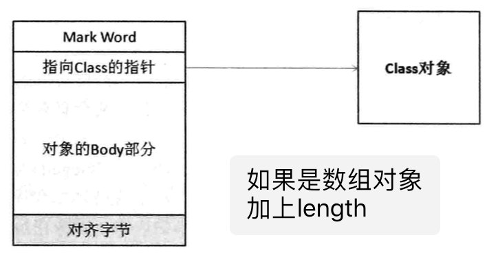

线程 wait notify notifyAll  synchronized
====
# wait notify 
一段最笑意的wait notify 代码

 ~~~java
 package sparkweb;
 
  
 public class Syn {
 	Object lock = new Object();
 	final static String b = "1234567";
 
 	public static void main(String[] args) {
 		final String cc = "567890";
 	}
 
 	public void say() {
 		final String a = b;
 
 		synchronized (lock) {
 			System.out.println(" byebye");
 		}
 	}
 }

 ~~~

## 1 引出下面几个问题
     ，
 1. 为什么wait notify 要放在 synchronized
 2. sleep 与wait 有什么区别
 3. 我们锁宝的时什么？
 4. wait ,notify 究竟做了什么
 5. JVM是怎么实现实现的synchronized

 
 
###  Q1 为什么wait notify 要放在 synchronize
- wait是Object 的方法，其实实现，任务一个普通Java对象都有这个方法
   > public final native void wait(long var1) throws InterruptedException;
   > 实际上最终调用 的是一个native方法 wait () 
   
-  wait 与notify 的方法说明,以wait为例 JavaDoc文档注释如下：
          Causes the current thread to wait until another thread invokes the
          `In other words, this method behaves exactly as if it simply
          The current thread must own this object's monitor` .(请注释这段，wait的前台是你已经得到了锁) 
          The thread releases ownership of this monitor and waits until another thread
          notifies threads waiting on this object's monitor to wake up
          either through a call to the {@code notify} method or the
          {@code notifyAll} method. The thread then waits until it can
          re-obtain ownership of the monitor and resumes execution.
    
- 锁什么？
  1. public ovid synchronized methodName() {}
     > 锁定当前对象
  2. public void method() {
        synchronized(this){
           // code
        }
     }
     > 锁定当前对象
     
  3. public ``static `` ovid synchronized methodName() {}
     > 锁定的 ClassName.calss 

  4.  public void method() {
         synchronized(Object){
                // code
             }
         }
      > 锁定Object对象

  `   ` 
  
  
  

### 查看 Syn编译后的class的字节码

1. `` javap -c Sync`` 
    > 注意 是 文件名，不要带后缀 .class, 否则一直提示找不到 Syn.class JVM 字节码内容，指令后方再触角
       
 
       Compiled from "Syn.java"
       public class sparkweb.Syn extends java.lang.Object{
       java.lang.Object lock;
       
       static final java.lang.String b;
       
       public sparkweb.Syn();
         Code:
          0:	aload_0
          1:	invokespecial	#1; //Method java/lang/Object."<init>":()V
          4:	aload_0
          5:	new	#2; //class java/lang/Object
          8:	dup
          9:	invokespecial	#1; //Method java/lang/Object."<init>":()V
          12:	putfield	#3; //Field lock:Ljava/lang/Object;
          15:	return
       
       public static void main(java.lang.String[]);
         Code:
          0:	ldc	#4; //String 567890
          2:	astore_1
          3:	return
       
       public void say();
         Code:
          0:	ldc	#6; //String 1234567
          2:	astore_1
          3:	aload_0
          4:	getfield	#3; //Field lock:Ljava/lang/Object;
          7:	dup
          8:	astore_2
          9:	`monitorenter
          10:	getstatic	#7; //Field java/lang/System.out:Ljava/io/PrintStream;
          13:	ldc	#8; //String  byebye
          15:	invokevirtual	#9; //Method java/io/PrintStream.println:(Ljava/lang/String;)V
          18:	aload_2
          19:	monitorexit
          20:	goto	28
          23:	astore_3
          24:	aload_2
          25:	monitorexit
          26:	aload_3
          27:	athrow
          28:	return
         Exception table:
          from   to  target type
           10    20    23   any
           23    26    23   any
       
       }
       

2. JVM如何实现锁 :` monitorenter`   ` monitorexit` 

   - synchronized关键字修饰的代码段，在JVM被编译为monitorenter、monitorexit指令来获取和释放互斥锁.
   - 锁的类型（如下三种）
     1. 偏向锁
     2. 轻量级锁
     3. 重量级锁
     
3.  说明锁的类型先解释一下Java Object对象的结棍 ，对象头。是与独立于java对象。
    
     
     - 在 HotSpot 虚拟机中，对象在内存中存储布局分为 3 块区域：对象头（Header）、实例数据（Instance Data）、对齐填充（Padding），下面详细讲解各部分内容。
        -  markword 第一部分markword,用于存储对象自身的运行时数据，如哈希码（HashCode）、GC分代年龄、锁状态标志、线程持有的锁、偏向线程ID、偏向时间戳等，这部分数据的长度在32位和64位的虚拟机（未开启压缩指针）中分别为32bit和64bit，官方称它为“MarkWord”。
          
        -  klass 对象头的另外一部分是klass类型指针，即对象指向它的类元数据的指针，虚拟机通过这个指针来确定这个对象是哪个类的实例.
           数组长度（只有数组对象有） 如果对象是一个数组, 那在对象头中还必须有一块数据用于记录数组长度.
   
4. synchronized由来 synchronized的原本是重量级别的锁
   
   -  就是在线程运行到该代码块的时候，让程序的运行级别从用户态切换到内核态，
   -  把所有的线程挂起，让cpu通过操作系统指令，去调度多线程之间，谁执行代码块，谁进入阻塞状态。
   -  这样会频繁出现程序运行状态的切换，线程的挂起和唤醒，这样就会大量消耗资源，程序运行的效率低下。
   -  为了提高效率，jvm的开发人员，引入了偏向锁，和轻量级锁，
   -  尽量让多线程访问公共资源的时候，不进行程序运行状态的切换，由用户态进入内核态，借助操作系统进行互斥。
     
5. synchronized 底层 (我猜想底层 还是c++代码插入汇编代码来实现)
   - jvm规范中可以看到synchronized在jvm里实现原理，
   - jvm基于进入和退出Monitor对象来实现方法同步和代码块同的。
   - 在代码同步的开始位置织入monitorenter,在结束同步的位置
   - （正常结束和异常结束处）织入monitorexit指令实现。
   - 线程执行到monitorenter处，讲会获取锁对象锁对应的monitor的所有权，
   - 即尝试获得对象的锁。（任意对象都又一个monitor与之关联，
   - 当且一个monitor被持有后，他处于锁定状态）

6. 这三种锁的锁的忖度不断升级
   - 偏向锁	 (jdk6默认开了，其实他的的场景依赖于：线程不在同某一点并发获取锁)
      > 加锁和解锁不需要额外的消耗，和执行非同步方法相比仅存在纳秒级的差距	如果线程间存在锁竞争，会带来额外的锁撤销的消耗	适用于只有一个线程访问同步块场景
   - 轻量级锁	( 当线程在不同cpu上执行，锁很快被释放时，自旋就有很大的优势了)
      > 竞争的线程不会阻塞，提高了程序的响应速度	如果始终得不到索竞争的线程，使用自旋会消耗CPU	追求响应速度，同步块执行速度非常快
   - 重量级锁	
      > 线程竞争不使用自旋，不会消耗CPU	线程阻塞，响应时间缓慢	追求吞吐量，同步块执行速度较长
     
### 起码的执行流程：
####  偏向锁
1.  访问Mark Word中偏向锁的标识是否设置成1，锁标志位是否为01——确认为可偏向状态。
2. 如果为可偏向状态，则测试线程ID是否指向当前线程，如果是，进入步骤（5），否则进入步骤（3）。
3. 如果线程ID并未指向当前线程，则通过CAS操作竞争锁。如果竞争成功，则将Mark Word中线程ID设置为当前线程ID，然后执行（5）；如果竞争失败，执行（4）。
4. 如果CAS获取偏向锁失败，则表示有竞争。当到达全局安全点（safepoint）时获得偏向锁的线程被挂起，偏向锁升级为轻量级锁，然后被阻塞在安全点的线程继续往下执行同步代码。
5. 执行同步代码。

#### 轻量级锁的加锁过程

1. 在代码进入同步块的时候，如果同步对象锁状态为无锁状态（锁标志位为“01”状态，是否为偏向锁为“0”），虚拟机首先将在当前线程的栈帧中建立一个名为锁记录（Lock Record）的空间，用于存储锁对象目前的Mark Word的拷贝，官方称之为 Displaced Mark Word。这时候线程堆栈与对象头的状态如图2.1所示。
2. 拷贝对象头中的Mark Word复制到锁记录中。
3. 拷贝成功后，虚拟机将使用CAS操作尝试将对象的Mark Word更新为指向Lock Record的指针，并将Lock record里的owner指针指向object mark word。如果更新成功，则执行步骤（3），否则执行步骤（4）。
4. 如果这个更新动作成功了，那么这个线程就拥有了该对象的锁，并且对象Mark Word的锁标志位设置为“00”，即表示此对象处于轻量级锁定状态，这时候线程堆栈与对象头的状态如图2.2所示。
5. 如果这个更新操作失败了，虚拟机首先会检查对象的Mark Word是否指向当前线程的栈帧，如果是就说明当前线程已经拥有了这个对象的锁，那就可以直接进入同步块继续执行。否则说明多个线程竞争锁，轻量级锁就要膨胀为重量级锁，锁标志的状态值变为“10”，Mark Word中存储的就是指向重量级锁（互斥量）的指针，后面等待锁的线程也要进入阻塞状态。 而当前线程便尝试使用自旋来获取锁，自旋就是为了不让线程阻塞，而采用循环去获取锁的过程。

#### 对比	
[【优点】  【缺点】   【  适用场景】

偏向锁  加锁和解锁不需要额外的消耗，和执行非同步方法比仅存在纳秒级的差距。

    如果线程间存在锁竞争，会带来额外的锁撤销的消耗。 适用于只有一个线程访问同步块场景。

轻量级锁  竞争的线程不会阻塞，提高了程序的响应速度。

    如果始终得不到锁竞争的线程使用自旋会消耗CPU。追求响应时间。同步块执行速度非常快。

重量级锁 线程竞争不使用自旋，不会消耗CPU。

    线程阻塞，响应时间缓慢。追求吞吐量。同步块执行速度较长。
     

### JVM字节码分析 

#### 还是 Syn.class为例子分析 jvm指令

1. 命令 javap -c -verbose Sync
    
        Compiled from "Syn.java"
        public class sparkweb.Syn extends java.lang.Object
          SourceFile: "Syn.java"
          minor version: 0
          major version: 52
          Constant pool:
        const #1 = Method	#2.#36;	//  java/lang/Object."<init>":()V
        const #2 = class	#37;	//  java/lang/Object
        const #3 = Field	#5.#38;	//  sparkweb/Syn.lock:Ljava/lang/Object;
        const #4 = String	#39;	//  567890
        const #5 = class	#40;	//  sparkweb/Syn
        const #6 = String	#41;	//  1234567
        const #7 = Field	#42.#43;	//  java/lang/System.out:Ljava/io/PrintStream;
        const #8 = String	#44;	//   byebye
        const #9 = Method	#45.#46;	//  java/io/PrintStream.println:(Ljava/lang/String;)V
        const #10 = Asciz	lock;
        const #11 = Asciz	Ljava/lang/Object;;
        const #12 = Asciz	b;
        const #13 = Asciz	Ljava/lang/String;;
        const #14 = Asciz	ConstantValue;
        const #15 = Asciz	<init>;
        const #16 = Asciz	()V;
        const #17 = Asciz	Code;
        const #18 = Asciz	LineNumberTable;
        const #19 = Asciz	LocalVariableTable;
        const #20 = Asciz	this;
        const #21 = Asciz	Lsparkweb/Syn;;
        const #22 = Asciz	main;
        const #23 = Asciz	([Ljava/lang/String;)V;
        const #24 = Asciz	args;
        const #25 = Asciz	[Ljava/lang/String;;
        const #26 = Asciz	cc;
        const #27 = Asciz	say;
        const #28 = Asciz	a;
        const #29 = Asciz	StackMapTable;
        const #30 = class	#40;	//  sparkweb/Syn
        const #31 = class	#47;	//  java/lang/String
        const #32 = class	#37;	//  java/lang/Object
        const #33 = class	#48;	//  java/lang/Throwable
        const #34 = Asciz	SourceFile;
        const #35 = Asciz	Syn.java;
        const #36 = NameAndType	#15:#16;//  "<init>":()V
        const #37 = Asciz	java/lang/Object;
        const #38 = NameAndType	#10:#11;//  lock:Ljava/lang/Object;
        const #39 = Asciz	567890;
        const #40 = Asciz	sparkweb/Syn;
        const #41 = Asciz	1234567;
        const #42 = class	#49;	//  java/lang/System
        const #43 = NameAndType	#50:#51;//  out:Ljava/io/PrintStream;
        const #44 = Asciz	 byebye;
        const #45 = class	#52;	//  java/io/PrintStream
        const #46 = NameAndType	#53:#54;//  println:(Ljava/lang/String;)V
        const #47 = Asciz	java/lang/String;
        const #48 = Asciz	java/lang/Throwable;
        const #49 = Asciz	java/lang/System;
        const #50 = Asciz	out;
        const #51 = Asciz	Ljava/io/PrintStream;;
        const #52 = Asciz	java/io/PrintStream;
        const #53 = Asciz	println;
        const #54 = Asciz	(Ljava/lang/String;)V;
        
        {
        java.lang.Object lock;
        
        
        static final java.lang.String b;
          Constant value: String 1234567
        
        public sparkweb.Syn();
          Code:
           Stack=3, Locals=1, Args_size=1
           0:	aload_0
           1:	invokespecial	#1; //Method java/lang/Object."<init>":()V
           4:	aload_0
           5:	new	#2; //class java/lang/Object
           8:	dup
           9:	invokespecial	#1; //Method java/lang/Object."<init>":()V
           12:	putfield	#3; //Field lock:Ljava/lang/Object;
           15:	return
          LineNumberTable: 
           line 6: 0
           line 7: 4
        
          LocalVariableTable: 
           Start  Length  Slot  Name   Signature
           0      16      0    this       Lsparkweb/Syn;
        
        
        public static void main(java.lang.String[]);
          Code:
           Stack=1, Locals=2, Args_size=1
           0:	ldc	#4; //String 567890
           2:	astore_1
           3:	return
          LineNumberTable: 
           line 11: 0
           line 12: 3
        
          LocalVariableTable: 
           Start  Length  Slot  Name   Signature
           0      4      0    args       [Ljava/lang/String;
           3      1      1    cc       Ljava/lang/String;
        
        
        public void say();
          Code:
           Stack=2, Locals=4, Args_size=1
           0:	ldc	#6; //String 1234567
           2:	astore_1
           3:	aload_0
           4:	getfield	#3; //Field lock:Ljava/lang/Object;
           7:	dup
           8:	astore_2
           9:	monitorenter
           10:	getstatic	#7; //Field java/lang/System.out:Ljava/io/PrintStream;
           13:	ldc	#8; //String  byebye
           15:	invokevirtual	#9; //Method java/io/PrintStream.println:(Ljava/lang/String;)V
           18:	aload_2
           19:	monitorexit
           20:	goto	28
           23:	astore_3
           24:	aload_2
           25:	monitorexit
           26:	aload_3
           27:	athrow
           28:	return
          Exception table:
           from   to  target type
            10    20    23   any
            23    26    23   any
          LineNumberTable: 
           line 15: 0
           line 17: 3
           line 18: 10
           line 19: 18
           line 20: 28
        
          LocalVariableTable: 
           Start  Length  Slot  Name   Signature
           0      29      0    this       Lsparkweb/Syn;
           3      26      1    a       Ljava/lang/String;
        
          StackMapTable: number_of_entries = 2
           frame_type = 255 /* full_frame */
             offset_delta = 23
             locals = [ class sparkweb/Syn, class java/lang/String, class java/lang/Object ]
             stack = [ class java/lang/Throwable ]
           frame_type = 250 /* chop */
             offset_delta = 4
        
        
        }
    

     
     
     
     
     
     
2.  回顾一下jvm的内存结构：heap stack , function area, constant_pool,native method stack
     请注意观察前面的字码码.
     final String xxx ="aaaa;实际上这行代码，中的字面值及对象是在常量池中保存
     final String s = new String(""aaaa"); // 字节码是怎么样的？
     
     

    
 
  
  
  
  
  
  
  
  
  
  
  
  

 
 

                 
                     
 
 
                    
>&copy; lxh_007@hotmail.com
 
  
  

