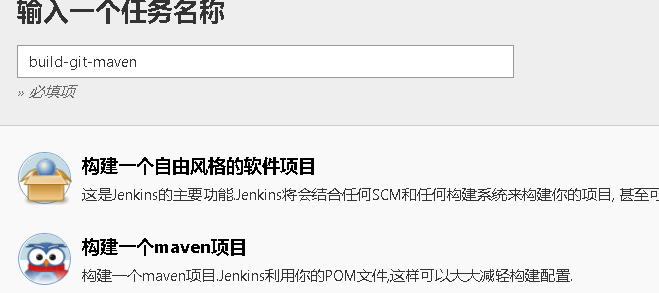
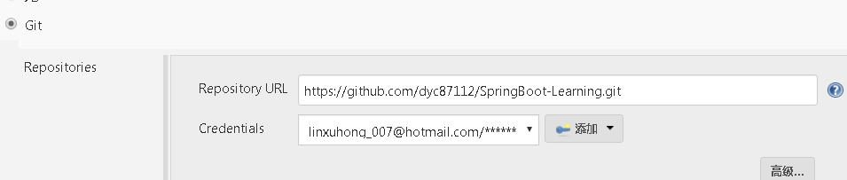
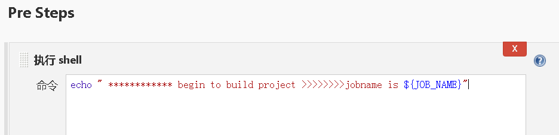
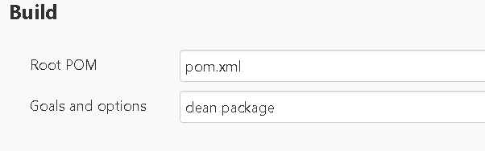
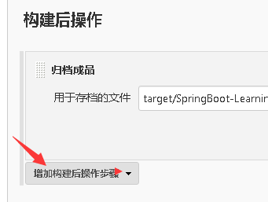
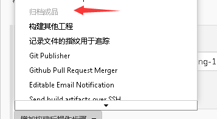
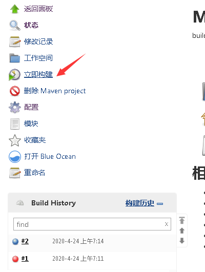
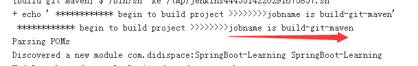
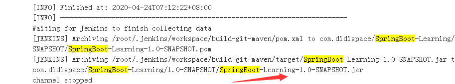
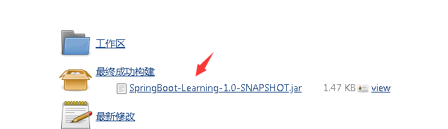

##    jenkis使用maven打包java 工程
>  当前目录 /usr/local/devtool

### 1.  【 新建任务】 或[ new item ] 
-   `选择maven项目，然后确定`
   

### 2. 配置SCM （git仓库地址）
    
-  `输入git项目地址，添加 用户名账号` 
  


### 3 . pre step
-    
```shell script
  echo " ************ begin to build project >>>>>>>>jobname is ${JOB_NAME}"
``` 

  


### 4. 配置maven执行参数  

- 配置参数    ` clean package`  

    
 

### 5. 打包完成
    
- 设置建完成后的操作  （归档文件名怎么生成，第6眇有说明）

   
   
    

### 6. 构建任务
 
- jenkins 首页点击任务 ，
    > **立即构建**
  
   
   
- 查看构建输出 :
     ************ begin to build project >>>>>>>>jobname is `build-git-maven`
     

     
   
   这个时候就可以知道第 5步中归档成品文件的名字了 `target/SpringBoot-Learning-1.0-SNAPSHOT.jar`

### 7. 查看结棍 
  
   