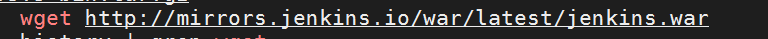
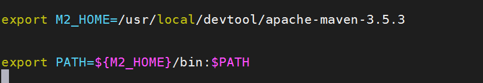
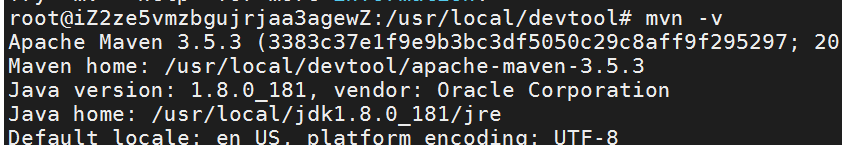
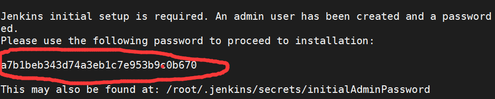
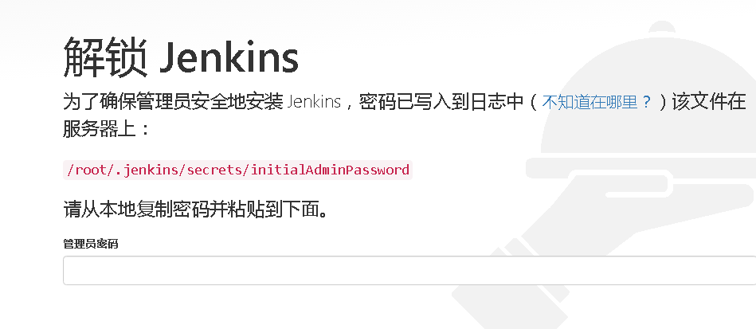
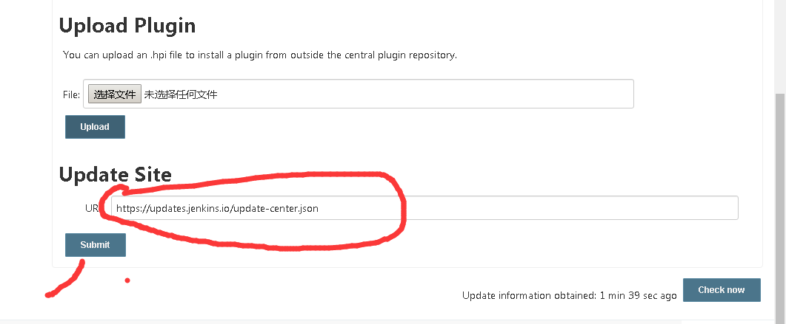
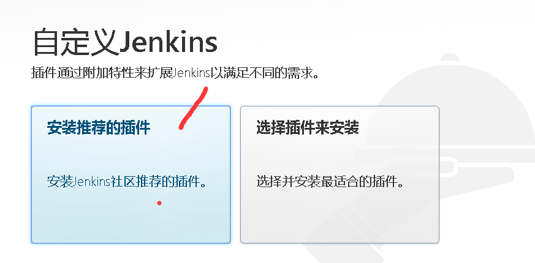
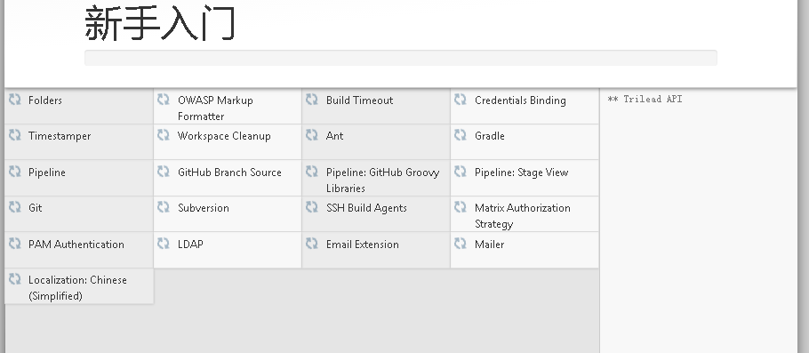

## ubuntu安装  jenkis ,maven
>  当前目录 /usr/local/devtool

### 1. 下载jenkis,maven 
    ```shell script 
     wget http://mirrors.jenkins.io/war/latest/jenkins.war
   
     wget https://archive.apache.org/dist/maven/maven-3/3.5.3/binaries/apache-maven-3.5.3-bin.tar.gz
     ```
   

### 2. 下载安装后，解压maven (存放目录 )
    
  ```shell script 
     tar -xvf  apache-maven-3.5.3-bin.tar.gz
   ```

### 3. 配置maven环境  

- 执行    `vi /etc/profile` 添加如下内容 保存退出
      
   ```shell script 
      export M2_HOME=/usr/local/devtool/apache-maven-3.5.3
      export PATH=${M2_HOME}/bin:$PATH
     ```
    
    
- 执行命令     source /etc/profile   

- 验证maven安装结果：    **_mvn -v_**    输出即为成功
  
   


### 4 . 启动 jenkis ,访问端口为 9191
- 启动  
    ```shell script 
       nohup java -Dhudson.model.DoSignatureCheck=true -jar jenkins.war --httpPort=9191 &
       ```

- 查看日志
   > tail -f nohup.out
- 查看初始密码

  

### 5. 配置jenkis环境   http://ip:port
   > 浏览器 访问：   127.0.0.1:9191  
   > 如下图成功后，表示启动没有问题，先放一边
  
   

5. 配置插件环境 ，浏览器打开另一标签页
- http://127.0.0.1:9191/pluginManager/advanced
  
    

- 将图中的 **update site** 内容替换成
   https://mirrors.tuna.tsinghua.edu.cn/jenkins/updates/update-center.json
  - 点击submit 
  - check now
   
6. 重新访问   127.0.0.1:9191  输入 密码，
    > **选择安装推荐插件**
  
   
   
7. 插件安装，过程比较慢，耐心等待即可

     
     
      
  >>>    绿色勾表示该插件安装成功

8. 略jenkis的CI?CD配置
