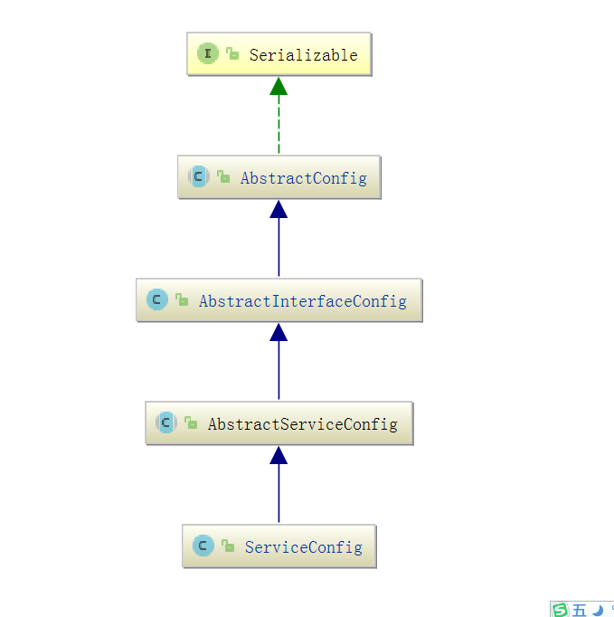
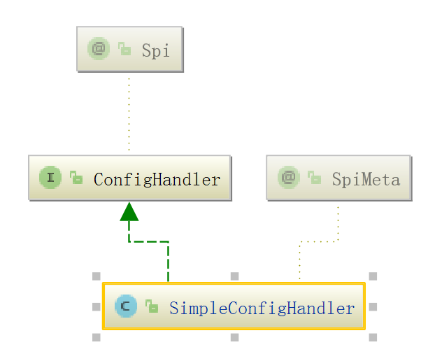
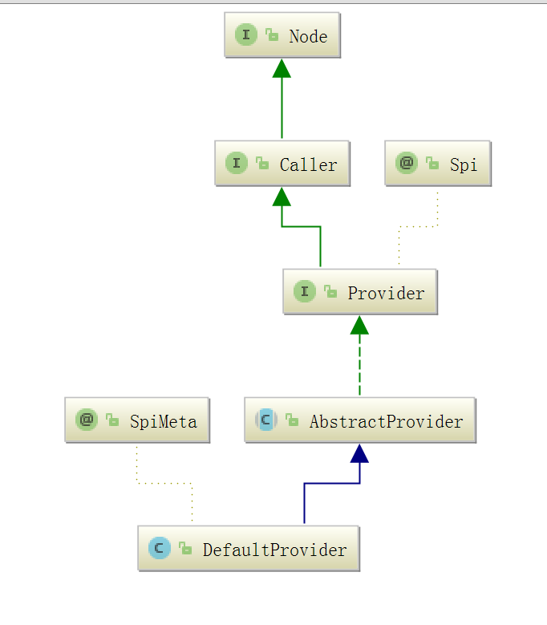
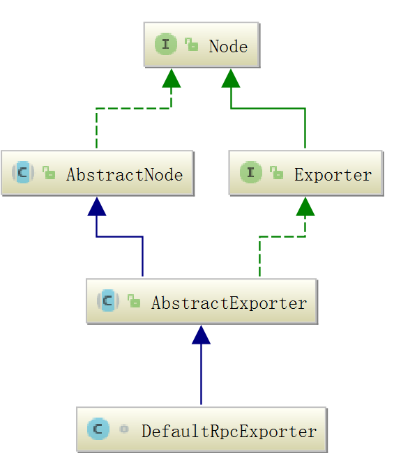
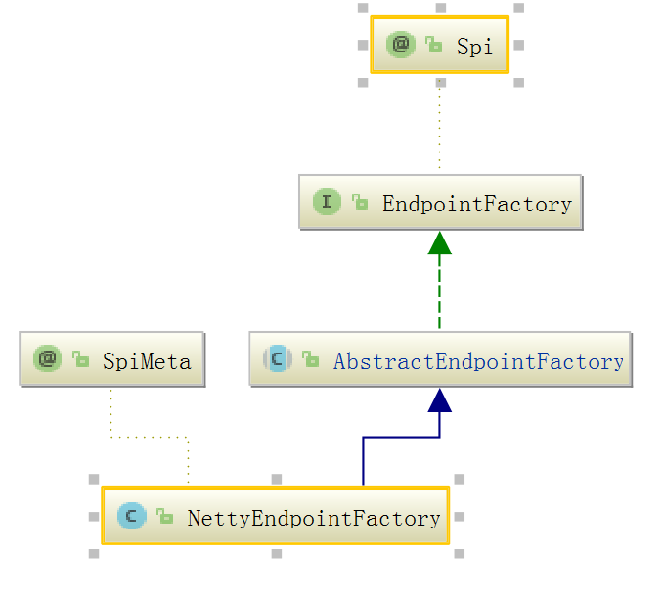
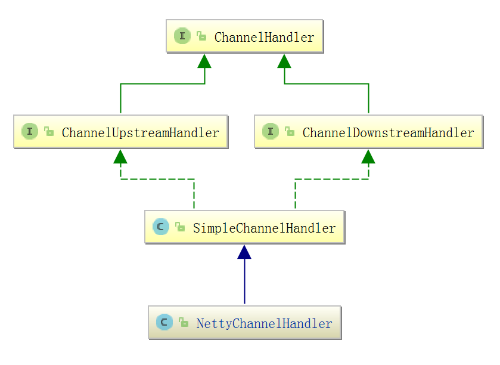

###            Sina Motan RPC 框架分析
                           
# 1. 场景
- motan是微博开源的一套轻量级、方便使用的RPC框架
- 项目地址：https://github.com/weibocom/motan
- Motan 是基于 Java 的高性能轻量级 RPC 框架，
   - 其具备实用的服务治理功能和 RPC 协议扩展能力。
   - 服务发现灵活支持多种配置管理组件，基于高并发高负载场景的高可用策略优化，
   - 良好的 SPI(Service Provider Interface)扩展，详细的调用统计，灵活支持多种 RPC 传输协议，在使用上，
   - 无缝支持Spring 配置方式，通过简单灵活的配置即可快速接入使用

# 2 架构图 （图片来自网上）
+ 整体结构
***
  
 
+ 分层结构
***
  

# 3 RPC框架要重点核心点 
## 推荐[从motan看RPC框架实现](http://kriszhang.com/motan-rpc-impl/)
## 核心内容  
   1. 如何与Spring做集成？
   2. SPI机制的实现原理是什么？为什么要用这个？
   3. 这么多的配置，究竟是如何在类间传递和保存的？
   4. 服务降级是如何做的？
   5. motan协议究竟是什么样子的？
   6. 服务发现和注册究竟是怎么做的？或者说客户端是如何找到服务端的？
   7. 为什么要用动态代理，到底proxy了什么？
   8. cluster的负载均衡和ha究竟是如何实现的？
   9. transport层是怎么进行抽象的？
   10.  client对server的心跳检测是怎么实现的呢？
   11. client端的连接池是如何管理的？
   12. server端的连接是如何共享的？
 
## 源代码分析关注点下几点
1. SPI机制的实现原理是什么？为什么要用这个？
2. 这么多的配置，究竟是如何在类间传递和保存的？
3. motan协议究竟是什么样子的？
4. 为什么要用动态代理，到底proxy了什么？
5. transport层是怎么进行抽象的？							 
6. transport层是怎么进行抽象的？							 
7.  client对server的心跳检测是怎么实现的呢？
8. client端的连接池是如何管理的？
9. server端的连接是如何共享的？
    
>  我将从以上几点对motan的源代码进行分析debug
   由于spring集成与解决涉及的内容比较多与杂，暂时先不作分析 
   

##  RPC本质的理解
1. 对于软件工程师来讲，形如object.method()的方法调用实在是太过熟悉，
当我们在同一个JVM进程内执行方法调用的时候，一切都显得顺其自然。
然而如果我们将上述的调用过程拆分成两个部分—-方法的调用端和方法的实现端，
然后将他们分别放置到不同的进程中，使得调用端和实现端能够做到跨操作系统，跨网络。这便是RPC的本质。

2. 从功能角度来讲，RPC框架可以分为服务治理型和多语言型。motan显然属于前者，
因此对motan框架可以简单的理解为：分离方法的调用和实现，并具双端服务治理功能。

> 1. 在同一jvm中就是 method.invoke(),而跨vm与网络时，则涉及到对象与数据的交换，而client方只用到了一个接口而已。
> 2. 如果打电话，通过电话号找到远程的你call you ,而你我分属不同的vm进程
 

# Quick Start       
## 入门例子
1. server demo 服务
   ```java
    import com.weibo.api.motan.common.MotanConstants;.
    import ...
    public class MotanApiExportDemo {
        public static void main(String[] args) throws InterruptedException {
            ServiceConfig<MotanDemoService> motanDemoService = new ServiceConfig<MotanDemoService>();
    
            // 设置接口及实现类
            motanDemoService.setInterface(MotanDemoService.class);
            motanDemoService.setRef(new MotanDemoServiceImpl());
    
            // 配置服务的group以及版本号
            motanDemoService.setGroup("motan-demo-rpc");
            motanDemoService.setVersion("1.0");
    
            // 配置注册中心直连调用
            // RegistryConfig directRegistry = new RegistryConfig();
            // directRegistry.setRegProtocol("local");
            // directRegistry.setCheck("false"); //不检查是否注册成功
            // motanDemoService.setRegistry(directRegistry);
    
            // 同志我本机没有安装 zk,因此将zk的地上注释 ，此时motan将默认使用local来注册
            RegistryConfig zookeeperRegistry = new RegistryConfig();
            // 配置ZooKeeper注册中心
           //   zookeeperRegistry.setRegProtocol("zookeeper");
           //   zookeeperRegistry.setAddress("127.0.0.1:2181");
            motanDemoService.setRegistry(zookeeperRegistry);
    
            // 配置RPC协议
            ProtocolConfig protocol = new ProtocolConfig();
            protocol.setId("motan");
            protocol.setName("motan");
            motanDemoService.setProtocol(protocol);
    
            motanDemoService.setExport("motan:8002");
            motanDemoService.export();
    
            MotanSwitcherUtil.setSwitcherValue(MotanConstants.REGISTRY_HEARTBEAT_SWITCHER, true);
    
            System.out.println("server start...");
        }
    }
     ```
     
-  ServiceConfig 显露外部服务的公用类，如果是用spring集成，将会使用其子类 ServiceConfigBean，暂时不讨论
   1. ServiceConfig 有两个属性  interface ,ref 分别代码接口与实现类。然后指名服务 的分组与版本.
   2. RegistryConfig  代码服务生成后，注册地上，暂时不用zk，因此注释设置相关属性的地方。
   3. ProtocolConfig 服务是用保种协议进行传输与调用的 motan
   4. ServiceConfig 设置~ setRegistryConfig,setProtocolConfig~ ,然后调用export就实现了

2. client调用
   ```java
         
    public class MotanApiClientDemo {
    
        public static void main(String[] args) throws InterruptedException {
            RefererConfig<MotanDemoService> motanDemoServiceReferer = new RefererConfig<MotanDemoService>();
    
            // 设置接口及实现类
            motanDemoServiceReferer.setInterface(MotanDemoService.class);
    
            // 配置服务的group以及版本号
            motanDemoServiceReferer.setGroup("motan-demo-rpc");
            motanDemoServiceReferer.setVersion("1.0");
            motanDemoServiceReferer.setRequestTimeout(300);
    
            // 配置注册中心直连调用
            // RegistryConfig directRegistry = new RegistryConfig();
            // directRegistry.setRegProtocol("local");
            // motanDemoServiceReferer.setRegistry(directRegistry);
    
            // 配置ZooKeeper注册中心
            RegistryConfig zookeeperRegistry = new RegistryConfig();
    //        zookeeperRegistry.setRegProtocol("zookeeper");
    //        zookeeperRegistry.setAddress("127.0.0.1:2181");
            motanDemoServiceReferer.setRegistry(zookeeperRegistry);
    
            // 配置RPC协议
            ProtocolConfig protocol = new ProtocolConfig();
            protocol.setId("motan");
            protocol.setName("motan");
            motanDemoServiceReferer.setProtocol(protocol);
            motanDemoServiceReferer.setDirectUrl("localhost:8002");  // 注册中心直连调用需添加此配置
    
            // 使用服务
            MotanDemoService service = motanDemoServiceReferer.getRef();
            for (int i=0;i<1000;i++) {
                System.out.println(service.hello("motan " +i));
                Thread.sleep(1000);
            }
    
            System.exit(0);
        }
    }

   ```
   
 -  RefererConfig 客户端对motan服务的一个封装，如果是用spring集成，将会使用其子类 RefererConfigBean，暂时不讨论
    1. RefererConfig 有两个属性  interface ,ref 分别代码接口与实现类。然后指名服务 的分组与版本.
    2. RegistryConfig  代码服务生成后，注册地上，暂时不用zk，因此注释设置相关属性的地方。
    3. ProtocolConfig 服务是用保种协议进行传输与调用的 motan
    4. RefererConfig#gerRef().hello() 通过远程调用返回 hello  motan
    > 这里使用setDirectUrl localhost:8002 主要是因为client,server在同一台机器上，但是端口仍然监听 
    
                        
***
     
# 公共组件部分
1. SPI：Service Provider Interface，主要通过ExtensionLoader提供扩展点功能，用来动态装载接口具体实现，以提供客户端扩展能力。
2. Logger：使用slf4j，提供整个框架统一的日志记录工具。
3. Statistic：使用定时回调方式，收集和记录框架监控信息。
4. URL：非Jdk里的URL。他对协议，路径，参数的统一抽象，系统也是使用URL来保存和读取配置信息的。
5. Switcher：提供开关控制服务，能够控制框架关键路径的升级和降级。
6. Exception：统一异常处理，分为业务异常，框架异常，服务异常等。
***
# 层的作用：

1. Config层：主要提供了配置读取，解析，实体生成。同时他也是整个框架的入口，
2. Proxy层：服务端无proxy，客户端具有代理功能，他通过InvocationHandler来拦截方法调用。目前只使用了jdk原生动态代理工具。
3. Registry层：用来进行服务发现和注册，server端进行服务的注册，client进行服务发现。目前有zk,consul的实现，还有对directUrl（就是p2p，不借助中心）的特殊处理。
4. Cluster层：集群功能，他提供了集群的服务暴露、服务引用、负载均衡，HA等。
5. Protocol层：协议层，目前只支持injvm和motan协议，主要就是提供给下层协议编码和解析，并且使用filter/pipe模式进行访问日志，最大并发量控制等功能。
6. Transport层：主要处理网络连接，他主要抽象了Client和Server接口。使用netty框架。

 
 ***
# Server端
## 要关注的问题
1. 配置解析与传递
2。服务URL与注册URL
3. SPI 机制
4. transport 封装
5. 服务暴露
6. 类图

***

## 从ServiceConfig.export()开始。
### 类图
  
####  ServiceConfig 主要逻辑：
```java

  
public class ServiceConfig<T> extends AbstractServiceConfig {
    private static ConcurrentHashSet<String> existingServices = new ConcurrentHashSet<String>();
    // 具体到方法的配置
    protected List<MethodConfig> methods;
    // 接口实现类引用
    private T ref;

    // service 对应的exporters，用于管理service服务的生命周期
    private List<Exporter<T>> exporters = new CopyOnWriteArrayList<Exporter<T>>();
    private Class<T> interfaceClass;
    private BasicServiceInterfaceConfig basicService;
    private AtomicBoolean exported = new AtomicBoolean(false);
    // service的用于注册的url，用于管理service注册的生命周期，url为regitry url，内部嵌套service url。
    private ConcurrentHashSet<URL> registereUrls = new ConcurrentHashSet<URL>();

    protected boolean serviceExists(URL url) {
        return existingServices.contains(url.getIdentity());
    }

    public synchronized void export() {
        if (exported.get()) {
            return;
        }
        // [1]
        checkInterfaceAndMethods(interfaceClass, methods);

        // [2]  AbstractInterfaceConfig#loadRegistryUrls  父类的方法来收集
        List<URL> registryUrls = loadRegistryUrls();
        if (registryUrls == null || registryUrls.size() == 0) {
            throw new IllegalStateException("Should set registry config for service:" + interfaceClass.getName());
        }

        Map<String, Integer> protocolPorts = getProtocolAndPort();
        for (ProtocolConfig protocolConfig : protocols) {
            Integer port = protocolPorts.get(protocolConfig.getId());
            if (port == null) {
                throw new MotanServiceException();
            }
            // [3]
            doExport(protocolConfig, port, registryUrls);
        }
        afterExport();
    }

    @SuppressWarnings("unchecked")
    private void doExport(ProtocolConfig protocolConfig, int port, List<URL> registryURLs) {
        String protocolName = protocolConfig.getName();
        if (protocolName == null || protocolName.length() == 0) {
            protocolName = URLParamType.protocol.getValue();
        }

        String hostAddress = host;
        if (StringUtils.isBlank(hostAddress) && basicService != null) {
            hostAddress = basicService.getHost();
        }
        if (NetUtils.isInvalidLocalHost(hostAddress)) {
            hostAddress = getLocalHostAddress(registryURLs);
        }

        Map<String, String> map = new HashMap<String, String>();

        map.put(URLParamType.nodeType.getName(), MotanConstants.NODE_TYPE_SERVICE);
        map.put(URLParamType.refreshTimestamp.getName(), String.valueOf(System.currentTimeMillis()));

        collectConfigParams(map, protocolConfig, basicService, extConfig, this);
        collectMethodConfigParams(map, this.getMethods());

        // {id=motan, export=motan:8002, protocol=motan, refreshTimestamp=1505801631928, group=motan-demo-rpc, nodeType=service, version=1.0}
        System.out.println(" 7 service param ==>" +map);
        URL serviceUrl = new URL(protocolName, hostAddress, port, interfaceClass.getName(), map);
        // [4]
        if (serviceExists(serviceUrl)) {
            throw new MotanFrameworkException();
        }

        List<URL> urls = new ArrayList<URL>();

        // injvm 协议只支持注册到本地，其他协议可以注册到local、remote
        if (MotanConstants.PROTOCOL_INJVM.equals(protocolConfig.getId())) {
            URL localRegistryUrl = null;
            for (URL ru : registryURLs) {
                if (MotanConstants.REGISTRY_PROTOCOL_LOCAL.equals(ru.getProtocol())) {
                    localRegistryUrl = ru.createCopy();
                    break;
                }
            }
            if (localRegistryUrl == null) {
                localRegistryUrl =
                        new URL(MotanConstants.REGISTRY_PROTOCOL_LOCAL, hostAddress, MotanConstants.DEFAULT_INT_VALUE,
                                RegistryService.class.getName());
            }
            urls.add(localRegistryUrl);
        } else {
            // TODO 我使用的是 local，因此会走到此处
            for (URL ru : registryURLs) {
                System.out.println(" ru "+ ru);
                urls.add(ru.createCopy());
            }
        }

        for (URL u : urls) {
            u.addParameter(URLParamType.embed.getName(), StringTools.urlEncode(serviceUrl.toFullStr()));
            registereUrls.add(u.createCopy());
        }
        
        // [local://127.0.0.1:0/com.weibo.api.motan.registry.RegistryService?group=default_rpc]
        System.out.println(" 8 registereUrls ==>" +registereUrls);
        ConfigHandler configHandler = ExtensionLoader.getExtensionLoader(ConfigHandler.class).getExtension(MotanConstants.DEFAULT_VALUE);
        // ~ [5]  ConfigHandler 如何加载 ~
        exporters.add(configHandler.export(interfaceClass, ref, urls));

        initLocalAppInfo(serviceUrl);
    }

    private void afterExport() {
        exported.set(true);
        for (Exporter<T> ep : exporters) {
            existingServices.add(ep.getProvider().getUrl().getIdentity());
        }
    }

    private void afterUnexport() {
        exported.set(false);
        for (Exporter<T> ep : exporters) {
            existingServices.remove(ep.getProvider().getUrl().getIdentity());
            exporters.remove(ep);
        }
        exporters.clear();
        registereUrls.clear();
    }

    @ConfigDesc(excluded = true)
    public BasicServiceInterfaceConfig getBasicService() {
        return basicService;
    }

    public void setBasicService(BasicServiceInterfaceConfig basicService) {
        this.basicService = basicService;
    }

    public Map<String, Integer> getProtocolAndPort() {
        return ConfigUtil.parseExport(this.export);
    }

    @ConfigDesc(excluded = true)
    public String getHost() {
    }

}
 
```
1.  无论是spring方式，还是api的方式，最终会调用export()方法
***
2.  loadRegistryUrls():返回注册中心地址，是一个list,打印出来后的结果如下：
    - []local://127.0.0.1:0/com.weibo.api.motan.registry.RegistryService?group=default_rpc]
    - AbstractInterfaceConfig#loadRegistryUrls 用于收集,serviceconfig中设置的注册中心信息
      > motanDemoService.setRegistry(zookeeperRegistry);
***
3. 执行 ` ServiceConfig#doExport() ` 方法 
   1. 根据一系统 参数构造一个服务 service URL,请注意（motan中有register url ,servcieurl）
       > URL serviceUrl = new URL(protocolName, hostAddress, port, interfaceClass.getName(), map);
   2. 此URL对象模仿了 java 标准api的方法 : protocol url param,后面再分析这个URL，这个是整个motan协议结构的中心
   3. 生成了 service  url,然后，通过sip的方式，找到ConfigHandler的实现类 SimpleConfigHandler
      - `  ConfigHandler configHandler = ExtensionLoader.getExtensionLoader(ConfigHandler.class).getExtension(MotanConstants.DEFAULT_VALUE); ` 
      - 通过configHandler个哦执行真正的export exporters.add(configHandler.export(interfaceClass, ref, urls))
         - `  configHandler.export(interfaceClass, ref, urls) ` 
          > 将 interfaceClass， ref，向多个注册中心，注册
 
 
#### SimpleConfigHandler 执行服务暴露

  

```java

@SpiMeta(name = MotanConstants.DEFAULT_VALUE)
public class SimpleConfigHandler implements ConfigHandler {

    @Override
    public <T> ClusterSupport<T> buildClusterSupport(Class<T> interfaceClass, List<URL> registryUrls) {
        ClusterSupport<T> clusterSupport = new ClusterSupport<T>(interfaceClass, registryUrls);
        clusterSupport.init();
        return clusterSupport;
    }

    @Override
    public <T> T refer(Class<T> interfaceClass, List<Cluster<T>> clusters, String proxyType) {
        ProxyFactory proxyFactory = ExtensionLoader.getExtensionLoader(ProxyFactory.class).getExtension(proxyType);
        return proxyFactory.getProxy(interfaceClass, new RefererInvocationHandler<T>(interfaceClass, clusters));
    }

    @Override
    public <T> Exporter<T> export(Class<T> interfaceClass, T ref, List<URL> registryUrls) {
        // motan://10.14.162.137:8002/com.weibo.motan.demo.service.MotanDemoService?id=motan&export=motan:8002&protocol=motan&refreshTimestamp=1505801631928&group=motan-demo-rpc&nodeType=service&version=1.0&
        String serviceStr = StringTools.urlDecode(registryUrls.get(0).getParameter(URLParamType.embed.getName()));
        System.out.println("5 SimpleConfigHandler export serviceStr ==>" +serviceStr);

        URL serviceUrl = URL.valueOf(serviceStr);
        // export service
        // 利用protocol decorator来增加filter特性
        String protocolName = serviceUrl.getParameter(URLParamType.protocol.getName(), URLParamType.protocol.getValue());
        Protocol ss = ExtensionLoader.getExtensionLoader(Protocol.class).getExtension(protocolName);
        Protocol protocol = new ProtocolFilterDecorator(ss);

        // com.weibo.api.motan.protocol.rpc.DefaultRpcProtocol@33f724c7
        System.out.println(" 11 default Protocol ==> " + ss);
        Provider<T> provider = new DefaultProvider<T>(ref, serviceUrl, interfaceClass);
        Exporter<T> exporter = protocol.export(provider, serviceUrl);
        // register service
        register(registryUrls, serviceUrl);

        return exporter;
    }

    @Override
    public <T> void unexport(List<Exporter<T>> exporters, Collection<URL> registryUrls) {
         /....
    }

    private void register(List<URL> registryUrls, URL serviceUrl) {

        for (URL url : registryUrls) {
            // 根据check参数的设置，register失败可能会抛异常，上层应该知晓
            RegistryFactory registryFactory = ExtensionLoader.getExtensionLoader(RegistryFactory.class).getExtension(url.getProtocol());
            if (registryFactory == null) {
                throw  new  Excepiton(..);
            }
            Registry registry = registryFactory.getRegistry(url);
            registry.register(serviceUrl);
        }
    }

    private void unRegister(Collection<URL> registryUrls) {
        for (URL url : registryUrls) {
                 // 不管check的设置如何，做完所有unregistry，做好清理工作
                String serviceStr = StringTools.urlDecode(url.getParameter(URLParamType.embed.getName()));
                URL serviceUrl = URL.valueOf(serviceStr);
                RegistryFactory registryFactory = ExtensionLoader.getExtensionLoader(RegistryFactory.class).getExtension(url.getProtocol());
                Registry registry = registryFactory.getRegistry(url);
                registry.unregister(serviceUrl);
            
        }
    }

}

```

##### SimpleConfigHandler#export()方法执行服务暴露(refer方法是客户端使用，暂时不讨论)
1.  motan服务协议的是怎么样的？
    - 根据注册地址生成servcie url ？
       - StringTools.urlDecode(registryUrls.get(0).getParameter(URLParamType.embed.getName()));
       - 为什么取的是注册地址第一个呢？ ` registryUrls.get(0).getParameter(URLParamType.embed.getName());`
         >  1. motan://192.168.1.1:8002/com.weibo.motan.demo.service.MotanDemoService?id=motan&export=motan:8002&protocol=motan&refreshTimestamp=1505801631928&group=motan-demo-rpc&nodeType=service&version=1.0&
            2. String serviceStr =
2. 服务协议初步分析:类似于java 标准api  URL类的方式
   -  motan  表示用motan协议
   -  192.168.1.1:8002:  当前服务的ip:port
   -  com.weibo.motan.demo.service.MotanDemoService :接口名
   -  ？号后面是参数，包括timestamp id version,group 等信息
3. 将 Service url字符串转换成 motan URL对象
   -  ` URL serviceUrl = URL.valueOf(serviceStr);`

4. 根据第3的URL对象。通过SPI机制找到对应的 Protocol 实现类
   - String protocolName = serviceUrl.getParameter(URLParamType.protocol.getName(), URLParamType.protocol.getValue());
   - Protocol ss = ExtensionLoader.getExtensionLoader(Protocol.class).getExtension(protocolName);
       > `  com.weibo.api.motan.protocol.rpc.DefaultRpcProtocol@33f724c7 `      
   -  使用decorate模拟，增强Protocol功能，添加过滤器，后面我在分析 
       > ` Protocol protocol = new ProtocolFilterDecorator(ss); `
   - 使用默认Provider实现来暴露服务 DefaultProvider ，此为将是service impl的调用就是一个invoke而已
       > 1. `Provider<T> provider = new DefaultProvider<T>(ref, serviceUrl, interfaceClass); `
       > 2. ` DefaultProvider 本质上是通过 invoke(request) 根据reqeust 来找到对应的method,反射调用方法，仅此而已`
   
   -- 如何将provider暴露 · Exporter<T> exporter = protocol.export(provider, serviceUrl);·
      
      > 服务暴露成功，则将服务添加 到对应注册中心地址。先export 再register

#####  DefaultProvider 如何封装服务端调用：原理 

1. 源代码

```java

@SpiMeta(name = "motan")
public class DefaultProvider<T> extends AbstractProvider<T> {
   protected T proxyImpl;

   // TODO SIimpleConfigHandler 中调用引构造器
   public DefaultProvider(T proxyImpl, URL url, Class<T> clz) {
       super(url, clz);
       this.proxyImpl = proxyImpl;
   }

   @Override
   public T getImpl(){
    return proxyImpl;
   }

   @Override
   public Response invoke(Request request) {
       DefaultResponse response = new DefaultResponse();
       // TODO netty 接收客户端请求，从中解析出方法名
       Method method = lookup(request);
       if (method == null) {
           MotanServiceException exception = ...
           response.setException(exception);
           return response;
       }
       try {
           // TODO 因为defaultprovider中已经知道是这个接口实现类了，因此 只需要invoke即可完成
           Object value = method.invoke(proxyImpl, request.getArguments());
           response.setValue(value);
       } catch (Exception e) {
           //服务发生错误时，显示详细日志
       } catch (Throwable t) {
           // 如果服务发生Error，将Error转化为Exception，防止拖垮调用方         //对于Throwable,也记录日志
           LoggerUtil.error("Exception caught when during method invocation. request:" + request.toString(), t);
       }
       // 传递rpc版本和attachment信息方便不同rpc版本的codec使用。
       response.setRpcProtocolVersion(request.getRpcProtocolVersion());
       response.setAttachments(request.getAttachments());
       return response;
   }
}

```
  



#####  DefaultRpcProtocol 如何暴露  DefaultProvider
1. xxx

```java

public class ProtocolFilterDecorator implements Protocol {
       public ProtocolFilterDecorator(Protocol protocol) {
            this.protocol = protocol; ///  TODO  默认使用  DefaultRpcProtocol 
        }
    
        @Override
        public <T> Exporter<T> export(Provider<T> provider, URL url) {
           // TODO 调用父类  AbstractProtocol#export方法
            return protocol.export(decorateWithFilter(provider, url), url);
        }
}

```

AbstractProtocol.java
```java
public abstract class AbstractProtocol implements Protocol {
    protected ConcurrentHashMap<String, Exporter<?>> exporterMap = new ConcurrentHashMap<String, Exporter<?>>();

    @SuppressWarnings("unchecked")
    @Override
    public <T> Exporter<T> export(Provider<T> provider, URL url) {
        String protocolKey = MotanFrameworkUtil.getProtocolKey(url);
        synchronized (exporterMap) {
            Exporter<T> exporter = (Exporter<T>) exporterMap.get(protocolKey);
            // TODO  此处会回调子类    DefaultRpcProtocol#createExporter
            exporter = createExporter(provider, url);
            // TODO 回调 AbstractNode#init()
            exporter.init();
            exporterMap.put(protocolKey, exporter);
            return exporter;
        }
    }

    public <T> Referer<T> refer(Class<T> clz, URL url) {
        // ...
    }

    @Override
    public <T> Referer<T> refer(Class<T> clz, URL url, URL serviceUrl) {
         // 略
    }

    protected abstract <T> Exporter<T> createExporter(Provider<T> provider, URL url);
    protected abstract <T> Referer<T> createReferer(Class<T> clz, URL url, URL serviceUrl);
}

```

DefaultRpcProtocol.java

```java

@SpiMeta(name = "motan")
public class DefaultRpcProtocol extends AbstractProtocol {

    // 多个service可能在相同端口进行服务暴露，因此来自同个端口的请求需要进行路由以找到相应的服务，同时不在该端口暴露的服务不应该被找到
    private Map<String, ProviderMessageRouter> ipPort2RequestRouter = new HashMap<String, ProviderMessageRouter>();

    @Override
    protected <T> Exporter<T> createExporter(Provider<T> provider, URL url) {
        return new DefaultRpcExporter<T>(provider, url);
    }

    @Override // 实现父类 
    protected <T> Referer<T> createReferer(Class<T> clz, URL url, URL serviceUrl) {
        return new DefaultRpcReferer<T>(clz, url, serviceUrl);
    }

    class DefaultRpcExporter<T> extends AbstractExporter<T> {
        private Server server;
        private EndpointFactory endpointFactory;

        public DefaultRpcExporter(Provider<T> provider, URL url) {
            super(provider, url);
            ProviderMessageRouter requestRouter = initRequestRouter(url);
            endpointFactory =                    ExtensionLoader.getExtensionLoader(EndpointFactory.class).getExtension(
                            url.getParameter(URLParamType.endpointFactory.getName(), URLParamType.endpointFactory.getValue()));
            server = endpointFactory.createServer(url, requestRouter);
        }

        @Override
        public void unexport() {
            String protocolKey = MotanFrameworkUtil.getProtocolKey(url);
            String ipPort = url.getServerPortStr();
            Exporter<T> exporter = (Exporter<T>) exporterMap.remove(protocolKey);
            if (exporter != null) {
                exporter.destroy();
            }
            synchronized (ipPort2RequestRouter) {
                ProviderMessageRouter requestRouter = ipPort2RequestRouter.get(ipPort);
                if (requestRouter != null) {
                    requestRouter.removeProvider(provider);
                }
            }
        }

        @Override
        protected boolean doInit() {   server.open();  }

        private ProviderMessageRouter initRequestRouter(URL url) {
            ProviderMessageRouter requestRouter = null;
            String ipPort = url.getServerPortStr();
            synchronized (ipPort2RequestRouter) {
                requestRouter = ipPort2RequestRouter.get(ipPort);
                if (requestRouter == null) {
                    requestRouter = new ProviderProtectedMessageRouter(provider);
                    ipPort2RequestRouter.put(ipPort, requestRouter);
                } else {
                    requestRouter.addProvider(provider);
                }
            }
            return requestRouter;
        }
    }

    class DefaultRpcReferer<T> extends AbstractReferer<T> {
        // TODO  先略去 
    }
}


```

1. ProtocolFilterDecorator(DefaultRpcProtocol proto)
2. 调用 AbstractProtocol.export();
3. export()回调子类 createExporter();
4. 创建内部类 DefaultRpcExporter
5. 完成exporter实现 

  
#####  DefaultRpcExporter 是如何 暴露的
######  DefaultRpcExporter.java

```java
class DefaultRpcExporter<T> extends AbstractExporter<T> {
    private Server server;
    private EndpointFactory endpointFactory;

    public DefaultRpcExporter(Provider<T> provider, URL url) {
        // TODO 1 调用父类  AbstractExporter
        super(provider, url);
        // TODO 2 requestRouter 其作用是将 request 映射到provider上
        ProviderMessageRouter requestRouter = initRequestRouter(url);
       // TODO  3 通过SPI找到 endpoint ,相当于底层传输层实现，
        endpointFactory =   ExtensionLoader.getExtensionLoader(EndpointFactory.class).getExtension(
                        url.getParameter(URLParamType.endpointFactory.getName(), URLParamType.endpointFactory.getValue()));
        // TODO 4 根据endpointfactory创建服务器，Server是一个接口，默认实现是NettyServer.java后面专门会分析
        server = endpointFactory.createServer(url, requestRouter);
    }
}
```
```java
public abstract class AbstractNode implements Node {
    @Override
    public synchronized void init() {
        if (init) {
            return;
        }
        boolean result = doInit();
    }
    // TODO DefaultRpcExporter会实现此方法
    protected abstract boolean doInit();
}
```

1. 整体调用链
- --> ProtocolFilterDecorator#export()
    - --> AbstractProtocol#export() 
      - --> 1. exporter = abstract createExporter(provider, url)
        - --> `DefaultRpcProtocol#createExporter()` 回调子类的createExporter
      - <-- 2. exporter.init() 父类继续调用 exporter 的init方法
        - -->  AbstractNode#init();
          - -->  DefaultRpcExporter#doInit(); 做真实的doInit打开 
          - -->  打开服务端server server.open()
      - <-- server 的初始化完成
 
2. endpointFactory.createServer(url, requestRouter)是什么?
> 1. 实现类是 ` NettyEndpointFactory`
> 2. 父类会回调 此类的 `innerCreateClient() `方法实例化` NettyServer `对象

```java
@SpiMeta(name = "motan")
public class NettyEndpointFactory extends AbstractEndpointFactory {
	@Override
	protected Server innerCreateServer(URL url, MessageHandler messageHandler) {
		return new NettyServer(url, messageHandler);
	}

   //  TODO 此处会被你类回调 
	@Override
	protected Client innerCreateClient(URL url) {
		return new NettyClient(url);
	}
}

```


```java

public abstract class AbstractEndpointFactory implements EndpointFactory {

    /** 维持share channel 的service列表 **/
    protected Map<String, Server> ipPort2ServerShareChannel = new HashMap<String, Server>();
    protected ConcurrentMap<Server, Set<String>> server2UrlsShareChannel = new ConcurrentHashMap<Server, Set<String>>();
    private EndpointManager heartbeatClientEndpointManager = null;

    public AbstractEndpointFactory() {
        heartbeatClientEndpointManager = new HeartbeatClientEndpointManager();
        heartbeatClientEndpointManager.init();
    }

    @Override
    public Server createServer(URL url, MessageHandler messageHandler) {
        HeartbeatFactory heartbeatFactory = getHeartbeatFactory(url);
        messageHandler = heartbeatFactory.wrapMessageHandler(messageHandler);
        synchronized (ipPort2ServerShareChannel) {
            String ipPort = url.getServerPortStr();
            System.out.println("createServer "+ipPort);
            String protocolKey = MotanFrameworkUtil.getProtocolKey(url);
            boolean shareChannel = url.getBooleanParameter(URLParamType.shareChannel.getName(), URLParamType.shareChannel.getBooleanValue());
            if (!shareChannel) { // 独享一个端口
                // 如果端口已经被使用了，使用该server bind 会有异常
                return innerCreateServer(url, messageHandler);
            }
            Server server = ipPort2ServerShareChannel.get(ipPort);
            if (server != null) {
                // can't share service channel
                if (!MotanFrameworkUtil.checkIfCanShallServiceChannel(server.getUrl(), url)) {
                }
                saveEndpoint2Urls(server2UrlsShareChannel, server, protocolKey);
                return server;
            }

            url = url.createCopy();
            url.setPath(""); // 共享server端口，由于有多个interfaces存在，所以把path设置为空
            // TODO  回调 NettyEndpointFactory# innerCreateServer
            server = innerCreateServer(url, messageHandler);
            ipPort2ServerShareChannel.put(ipPort, server);
            saveEndpoint2Urls(server2UrlsShareChannel, server, protocolKey);
            return server;
        }
    }

    @Override
    public Client createClient(URL url) {
        return createClient(url, heartbeatClientEndpointManager);
    }

    @Override
    public void safeReleaseResource(Server server, URL url) {
        safeReleaseResource(server, url, ipPort2ServerShareChannel, server2UrlsShareChannel);
    }

    @Override
    public void safeReleaseResource(Client client, URL url) { }

    private <T extends Endpoint> void safeReleaseResource(T endpoint, URL url, Map<String, T> ipPort2Endpoint,ConcurrentMap<T, Set<String>> endpoint2Urls) {
    }

    private <T> void saveEndpoint2Urls(ConcurrentMap<T, Set<String>> map, T endpoint, String namespace) { }

    private HeartbeatFactory getHeartbeatFactory(URL url) {}

    private Client createClient(URL url, EndpointManager endpointManager) {
        Client client = innerCreateClient(url);
        endpointManager.addEndpoint(client);
        return client;
    }
    protected abstract Server innerCreateServer(URL url, MessageHandler messageHandler);
    protected abstract Client innerCreateClient(URL url);

}
```
  
  
1. createServer最终会返回一个` new NettyServer(url, messageHandler); `对象

```java

public class NettyServer extends AbstractServer implements StatisticCallback {
	// default io thread is Runtime.getRuntime().availableProcessors() * 2
	private final static ChannelFactory channelFactory = new NioServerSocketChannelFactory(
			Executors.newCachedThreadPool(new DefaultThreadFactory("nettyServerBoss", true)),
			Executors.newCachedThreadPool(new DefaultThreadFactory("nettyServerWorker", true)));

	// 单端口需要对应单executor 1) 为了更好的隔离性 2) 为了防止被动releaseExternalResources:
	private StandardThreadExecutor standardThreadExecutor = null;
	
	protected NettyServerChannelManage channelManage = null;
	private org.jboss.netty.channel.Channel serverChannel;
	private ServerBootstrap bootstrap;
	private MessageHandler messageHandler;

	public NettyServer(URL url, MessageHandler messageHandler) {
	    // TODO  调用父类构造器，初始化 encode ,decode 
		super(url);
		/** T
		    public AbstractServer(URL url) {
                this.url = url;
                this.codec =
                        ExtensionLoader.getExtensionLoader(Codec.class).getExtension(
                                url.getParameter(URLParamType.codec.getName(), URLParamType.codec.getValue()));
            }
        */
		this.messageHandler = messageHandler;
	}

	@Override
	public Response request(Request request) throws TransportException {
		throw new MotanFrameworkException("NettyServer request(Request request) method unsupport: url: " + url);
	}

	@Override
	public synchronized boolean open() {
		if (isAvailable()) {
			return true;
		}

		initServerBootstrap();

		serverChannel = bootstrap.bind(new InetSocketAddress(url.getPort()));
		state = ChannelState.ALIVE;

		StatsUtil.registryStatisticCallback(this);
		LoggerUtil.info("NettyServer ServerChannel finish Open: url=" + url);

		return state.isAliveState();
	}

	private synchronized void initServerBootstrap() {
		boolean shareChannel = url.getBooleanParameter(URLParamType.shareChannel.getName(),
				URLParamType.shareChannel.getBooleanValue());
		final int maxContentLength = url.getIntParameter(URLParamType.maxContentLength.getName(),
				URLParamType.maxContentLength.getIntValue());
		int maxServerConnection = url.getIntParameter(URLParamType.maxServerConnection.getName(),
				URLParamType.maxServerConnection.getIntValue());
		int workerQueueSize = url.getIntParameter(URLParamType.workerQueueSize.getName(),
				URLParamType.workerQueueSize.getIntValue());

		int minWorkerThread = 0, maxWorkerThread = 0;

		if (shareChannel) {
			minWorkerThread = url.getIntParameter(URLParamType.minWorkerThread.getName(),
					MotanConstants.NETTY_SHARECHANNEL_MIN_WORKDER);
			maxWorkerThread = url.getIntParameter(URLParamType.maxWorkerThread.getName(),
					MotanConstants.NETTY_SHARECHANNEL_MAX_WORKDER);
		} else {
			minWorkerThread = url.getIntParameter(URLParamType.minWorkerThread.getName(),
					MotanConstants.NETTY_NOT_SHARECHANNEL_MIN_WORKDER);
			maxWorkerThread = url.getIntParameter(URLParamType.maxWorkerThread.getName(),
					MotanConstants.NETTY_NOT_SHARECHANNEL_MAX_WORKDER);
		}

		
		standardThreadExecutor = (standardThreadExecutor != null && !standardThreadExecutor.isShutdown()) ? standardThreadExecutor
				: new StandardThreadExecutor(minWorkerThread, maxWorkerThread, workerQueueSize,
						new DefaultThreadFactory("NettyServer-" + url.getServerPortStr(), true));
		standardThreadExecutor.prestartAllCoreThreads();

		// 连接数的管理，进行最大连接数的限制 
		channelManage = new NettyServerChannelManage(maxServerConnection);

		bootstrap = new ServerBootstrap(channelFactory);
		bootstrap.setOption("child.tcpNoDelay", true);
		bootstrap.setOption("child.keepAlive", true);

		final NettyChannelHandler handler = new NettyChannelHandler(NettyServer.this, messageHandler,
				standardThreadExecutor);

		bootstrap.setPipelineFactory(new ChannelPipelineFactory() {
        			// FrameDecoder非线程安全，每个连接一个 Pipeline
        			public ChannelPipeline getPipeline() {
        				ChannelPipeline pipeline = Channels.pipeline();
        				pipeline.addLast("channel_manage", channelManage);
        				pipeline.addLast("decoder", new NettyDecoder(codec, NettyServer.this, maxContentLength));
        				pipeline.addLast("encoder", new NettyEncoder(codec, NettyServer.this));
        				pipeline.addLast("handler", handler);
        				return pipeline;
        			}
        });
	}

	@Override
	public synchronized void close() {
		close(0);
	}

	@Override
	public synchronized void close(int timeout) {
		if (state.isCloseState()) {
			LoggerUtil.info("NettyServer close fail: already close, url={}", url.getUri());
			return;
		}
		if (state.isUnInitState()) {
			return;
		}
		try {
			// close listen socket
			serverChannel.close();
			// close all clients's channel
			channelManage.close();
			// shutdown the threadPool
			standardThreadExecutor.shutdownNow();
			// 设置close状态
			state = ChannelState.CLOSE;
			// 取消统计回调的注册
			StatsUtil.unRegistryStatisticCallback(this);
		} catch (Exception e) {
		}
	}

	/**
	 * 统计回调接口
	 */
	@Override
	public String statisticCallback() {
		return String.format(
				"identity: %s connectionCount: %s taskCount: %s queueCount: %s maxThreadCount: %s maxTaskCount: %s",
				url.getIdentity(), channelManage.getChannels().size(), standardThreadExecutor.getSubmittedTasksCount(),
				standardThreadExecutor.getQueue().size(), standardThreadExecutor.getMaximumPoolSize(),
				standardThreadExecutor.getMaxSubmittedTaskCount());
	}

	/**
	 * 是否已经绑定端口
	 */
	@Override
	public boolean isBound() {
		return serverChannel != null && serverChannel.isBound();
	}
}

```

1. NettyServer.open()做了什么？ 创建了一个netty server ，监听 指定端口。
   - 设置 ip port 
   - 在pipeline中增加channel factory 
   - 增加编码，解码器 codes :后面分析 
   - 注册业务handler : NettyChannelHandler
     > pipeline.addLast("handler", handler);
     
2. NettyChannelHandler 的逻辑是什么？

  
 
继承了Netty包中的 SimpleChannelHandler 复写父类的三个方法
+ channelConnected 
+ channelDisconnected
+ messageReceived(ChannelHandlerContext ctx, MessageEvent e) 主要处理逻辑
+ 主要逻辑：
  - 判断e事件类型motan定义的  Request  ==>  processRequest(ctx, e);
  - 判断e事件类型motan定义的  Response ==>  processResponse(ctx, e);
  - 对于 server来说  Request 主要来自于client的请求 

+ processRequest 逻辑如下：
  - 每一个request会被封装成一个Runnable作为task 供线程池处理
    -  threadPoolExecutor.execute(new Runnable() { 
          processRequest(ChannelHandlerContext ctx, Request request, long processStartTime) {
       }
    - processRequest(ChannelHandlerContext ctx, Request request, long processStartTime)实现关键内容
      >` Object result = messageHandler.handle(serverChannel, request);
      ***`
    - 获取 service imp的方法调用结果，将结果写入netty 通道。
+ messageHandler 是什么？作用
  - 对于每一个request请求，服务端需要路由找到对应的接口实现方法，然后invoke得到结果
  - messageHandler从如果来的  DefaultRpcExporter 的构造函数创建，通过encpoint factory方法传递进来的
  
     
  
```java
public class NettyChannelHandler extends SimpleChannelHandler {
	private ThreadPoolExecutor threadPoolExecutor;
	private MessageHandler messageHandler;
	private Channel serverChannel;

	public NettyChannelHandler(Channel serverChannel, MessageHandler messageHandler,
			ThreadPoolExecutor threadPoolExecutor) {
		this.serverChannel = serverChannel;
		this.messageHandler = messageHandler;
		this.threadPoolExecutor = threadPoolExecutor;
	}

	@Override
	public void channelConnected(ChannelHandlerContext ctx, ChannelStateEvent e) throws Exception {
	}

	@Override
	public void channelDisconnected(ChannelHandlerContext ctx, ChannelStateEvent e) throws Exception {
	}

	@Override
	public void messageReceived(ChannelHandlerContext ctx, MessageEvent e) throws Exception {
		Object message = e.getMessage();

		if (message instanceof Request) {
			processRequest(ctx, e);
		} else if (message instanceof Response) {
			processResponse(ctx, e);
		} else {
			throw new  Exception();
		}
	}

	/**
	 *  request process: 主要来自于client的请求，需要使用threadPoolExecutor进行处理，避免service message处理比较慢导致iothread被阻塞
	 */
	private void processRequest(final ChannelHandlerContext ctx, MessageEvent e) {
		final Request request = (Request) e.getMessage();
		request.setAttachment(URLParamType.host.getName(), NetUtils.getHostName(ctx.getChannel().getRemoteAddress()));
		final long processStartTime = System.currentTimeMillis();
		// 使用线程池方式处理
		try {
			threadPoolExecutor.execute(new Runnable() {
				@Override
                public void run() {
				    try{
				        RpcContext.init(request);
						System.out.println("ctx instance ==>" +ctx.toString());
	                    processRequest(ctx, request, processStartTime);
				    }finally{
				        RpcContext.destroy();
				    }
                }
            });
		} catch (RejectedExecutionException rejectException) {
		}
	}

	private void processRequest(ChannelHandlerContext ctx, Request request, long processStartTime) {
		// TODO 根据 路由判断，找到对应的rpvoder#invoke 其实最终找到的是DefautlProvider类 
	    Object result = messageHandler.handle(serverChannel, request);
		DefaultResponse response = null;
		if (!(result instanceof DefaultResponse)) {
			response = new DefaultResponse(result);
		} else {
			response = (DefaultResponse) result;
		}
		response.setRequestId(request.getRequestId());
		response.setProcessTime(System.currentTimeMillis() - processStartTime);
		if (ctx.getChannel().isConnected()) {
		    // TODO 回写结果到客户端
			ctx.getChannel().write(response);
		}
	}

	private void processResponse(ChannelHandlerContext ctx, MessageEvent e) {
		messageHandler.handle(serverChannel, e.getMessage());
	}

	@Override
	public void exceptionCaught(ChannelHandlerContext ctx, ExceptionEvent e) throws Exception {
		ctx.getChannel().close();
	}
}

```
# 稍微总结一下
ServiceConfig #export())
 - -> doExport()
   -  -> ConfigHandler的实现 SimpleConfigHandler#export
        -  -> 构造service url
        -  -> 构造s Protocol 默认实现类 DefaultProtocol
        -  -> 构造s Provider 默认实现类 DefaultProvider
        -  -> Protocol.exporter(provider,serviceUrl ) 构造s Exporter 默认实现类 
           -  -> DefaultRpcProtocol#createExporter : new DefaultRpcExporter() 实例后 init
              - -> DefaultRpcExporter构造器
                - -> 实例化 server:生成一个nettyserver对象，使用netty api构造一个bootstrap监听 指定端口
                - -> 实例化 ProviderMessageRouter 路由
              - -> DefaultRpcExporter 实例 doInit()
                 - -> server.open(); 完成服务端端口监听 服务启动。
        

# 待续


    |   URL  |   URL  |
    | ------- | ---- |
    | htt   |      ||  
     