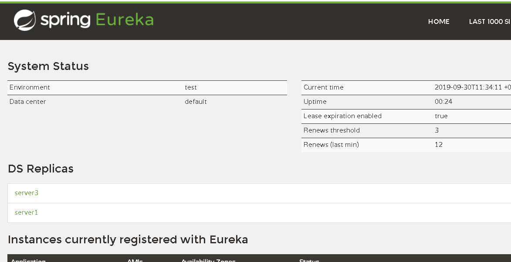

#### Eureka 


     
### 1  Eureka  server 单机配置

1.   程序

 
   ```java
    import org.springframework.boot.SpringApplication;
    import org.springframework.boot.autoconfigure.SpringBootApplication;
    import org.springframework.cloud.netflix.eureka.server.EnableEurekaServer;
    
    @SpringBootApplication
    @EnableEurekaServer
    public class MagicCloudApplication {
    
        public static void main(String[] args) {
            SpringApplication.run(MagicCloudApplication.class, args);
        }
    
    }

      
``` 

   ```yaml
    server:
      port: 9999
    
    eureka:
      instance:
        hostname: localhost
      client:
        registerWithEureka: false
        fetchRegistry: false
        serviceUrl:
          defaultZone: http://${eureka.instance.hostname}:${server.port}/eureka/

``` 


2.  参数说明   
server.port  访问时 127.0.0.1：9999 或者 localhost:9999访问 配置中心serveer
  
3. 访问  http://localhost:9999

       
 

### Eureka  server 集群 配置

1. java代码同单机版

2. 配置
  - 新建三个配置文件  
     application-server1.yml
     application-server2.yml
     application-server3.yml
   - 修改host文件增加host   C:\Windows\System32\drivers\etc
      127.0.0.1  localhost server1 server2 server3
     
3. 文件
这三个文件格式 基本一样。有三个地方注意不同
 
   - server:   port: 9999   端口号
   - defaultZone : 不包含当前server的信息

application-server1.yml
  
   ```yaml
    server:
      port: 9998
    
    eureka:
      instance:
        hostname: server1
        instance-id: ${spring.application.name}:${server.port}
      client:
        registerWithEureka: false
        fetchRegistry: false
        serviceUrl:
          defaultZone: http://server2:9997/eureka/,http://server3:9996/eureka/
    
    spring:
      application:
        name: first
``` 
 
application-server2.yml
  
   ```yaml
   server:
     port: 9997
   
   
   eureka:
     instance:
       hostname: server2
       instance-id: ${spring.application.name}:${server.port}
     client:
       registerWithEureka: false
       fetchRegistry: false
       serviceUrl:
         defaultZone: http://server1:9998/eureka/,http://server3:9996/eureka/
   
   spring:
     application:
       name: second

``` 
 
  
application-server3.yml
  
   ```yaml
  server:
    port: 9996
  
  eureka:
    instance:
      hostname: server3
      instance-id: ${spring.application.name}:${server.port}
    client:
      registerWithEureka: false
      fetchRegistry: false
      serviceUrl:
        defaultZone: http://server1:9998/eureka/,http://server2:9997/eureka/
  
  spring:
    application:
      name: third

``` 

4. 结果如上图


# 结束  

 


